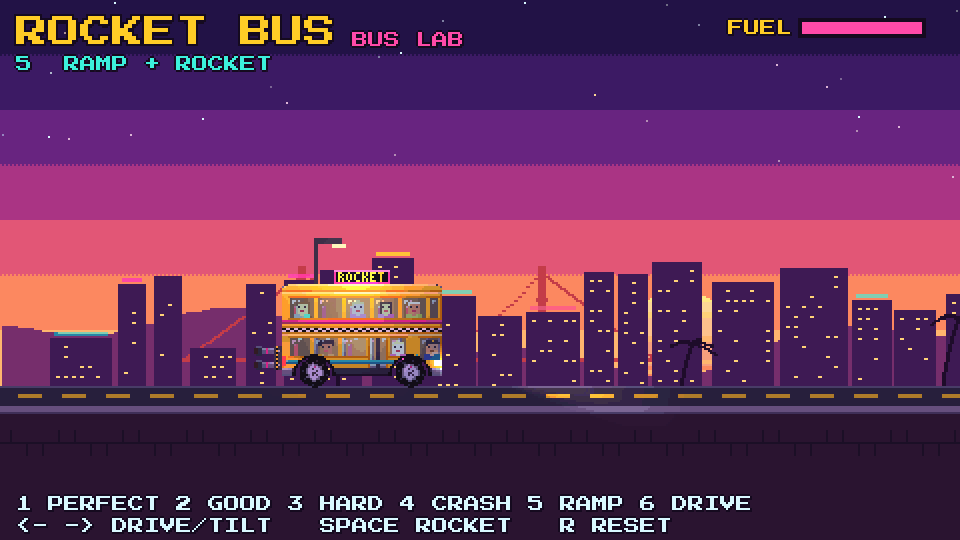

# Rocket Bus

A double-decker bus with a rocket strapped to the back. Launch off ramps, time the
rocket to clear the gap, and land it level, or the bus tears itself apart.

**Play:** https://pwshfan1980h.github.io/rocket-bus/

Built with Godot 4.7 (GL Compatibility, 480x270 pixel art).

## Controls
| Key | Action |
|---|---|
| D / → | Throttle on the ground, nose down in the air |
| A / ← | Brake/reverse on the ground, nose up in the air |
| Space | Rocket (limited fuel) |
| H | Horn |
| R | Retry |
| Esc | Pause |

## Development
- Open the folder in Godot 4.7.2 and press play.
- `python3 tools/gen_art.py` regenerates the pixel art in `assets/sprites`.
- Every push to `main` builds the web version and deploys it to GitHub Pages.
